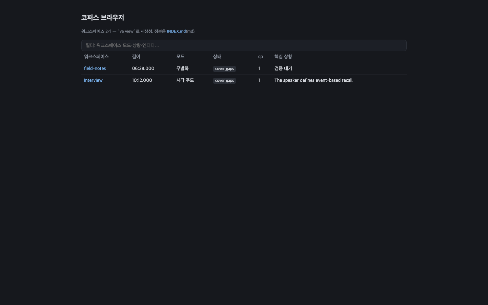
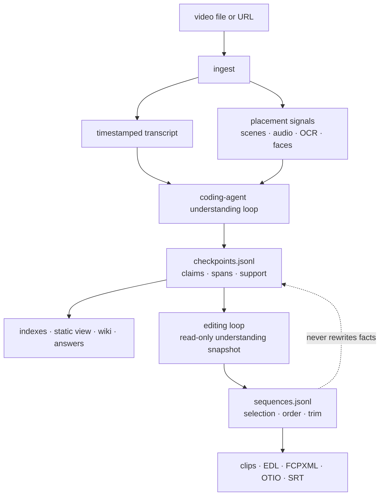
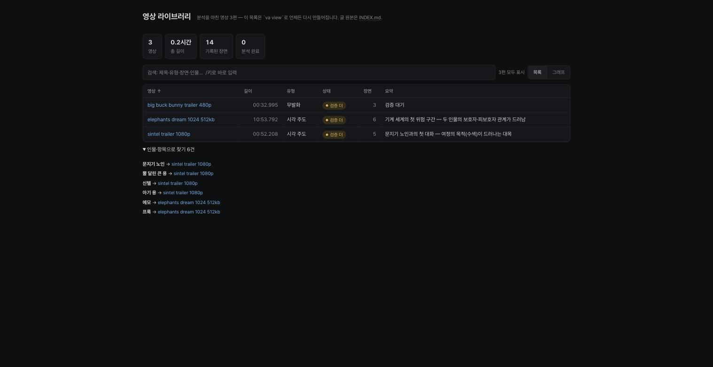
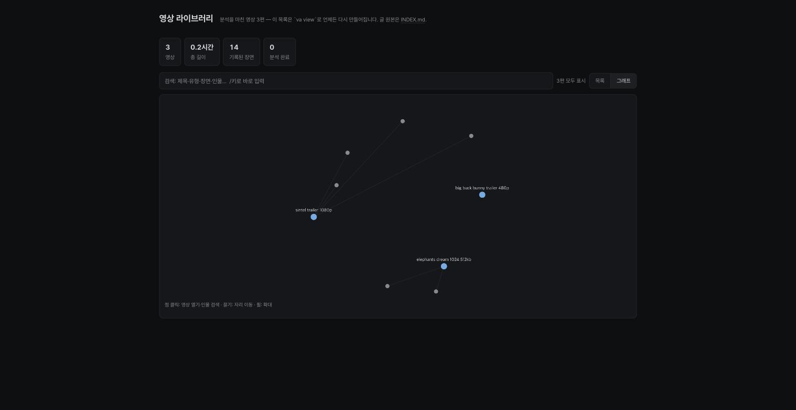
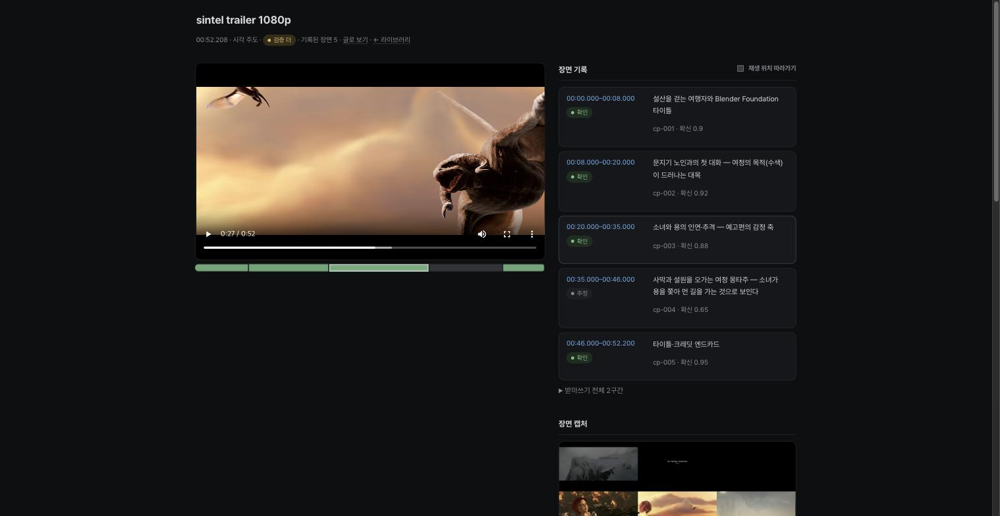
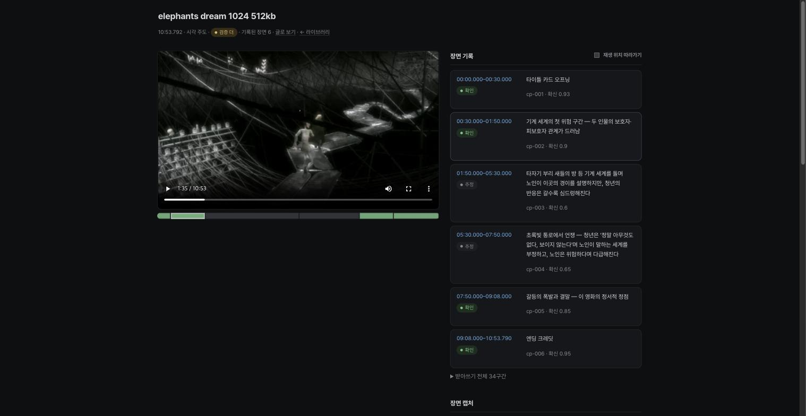

<div align="center">

<picture>
  <source media="(prefers-color-scheme: dark)" srcset="assets/brand/mark-dark.svg">
  
</picture>

# timecode:agent

**From long video to reusable, timestamped evidence.**

인간은 프레임이 아니라 사건을 기억한다.

[](.github/workflows/ci.yml)
[](LICENSE)
[](https://www.python.org/)
[](#요구-사항)

[English](README.md) · **한국어**

</div>

TIMECODE-AGENT는 코딩 에이전트가 긴 영상을 **로컬에 남는 재사용 가능한
근거 원장**으로 바꾸도록 돕는다.

- **전사 우선.** ingest는 프레임을 모델에 보내기 전에 타임스탬프 전사
  (업로더가 올린 자막이 있으면 재사용)와 결정적 placement 신호 —
  장면전환·오디오 에너지·OCR·얼굴 — 를 먼저 만든다.
- **지연 시각검증.** 코딩 에이전트는 주장에 시각적 확인이 필요한 순간만
  들여다보고, 확인한 내용을 일회성 답변이 아닌 시간 주소가 달린
  체크포인트로 기록한다.
- **남는 근거.** 체크포인트·캡처 출처·편집 결정은 append-only 원장에
  쌓이고, 인덱스·정적 코퍼스 브라우저·위키 페이지는 그 위에 언제든
  다시 만들 수 있는 투영이다.
- **근거 기반 편집 인계.** EDL·FCPXML·OTIO 산출물은 저장되지 않은 모델
  답변이 아니라 기록된 체크포인트 또는 고정된 시퀀스에서 파생된다.
  클립 추출과 SRT 렌더링은 임의 구간·전체 전사에도 동작하는 보조
  유틸리티다.

대표 용도: 긴 영상을 다시 보지 않고 질문에 답하기, 컷마다 근거가 달린
하이라이트·쇼츠 만들기, 여러 영상에 걸친 검색 가능한 코퍼스·위키
키우기.

## 빠른 시작

```bash
git clone https://github.com/mupozg823/timecode-agent.git && cd timecode-agent
uv tool install --python 3.12 .

va ingest show.mp4 --model small --signals
va brief va-out/show
va capture va-out/show -t 1:23 -t 95
va status va-out/show
```

첫 패스가 재사용 가능한 로컬 산출물을 만든다. 코딩 에이전트는 그
산출물을 읽고, 판단에 중요한 공백만 들여다본 뒤, 근거 있는 편집을
내보내기 전에 지지된 체크포인트를 기록한다.



## 최근 반영

- **자막 우선 ingest** — 소스에 자막 트랙이 있으면 오디오를 다시
  받아쓰는 대신 재사용한다.
- **무음 중단 전사 가드** — VAD가 감지한 발화량과 대조하는 커버리지
  검사로 faster-whisper의 비결정적 중도 중단을 잡아내고, 더 안전한
  설정으로 1회 재전사한다;
  [사례 연구](#사례-연구-소리-없이-끊긴-전사) 참고.
- **전 기능 기본 설치 + 정책 계층** — 모든 기능이 기본 설치되고,
  `va runtime`으로 재설치 없이 ASR 백엔드·클립 인코더·기능 토글을
  조회·전환한다. Apple Silicon의 `low-power` 프로파일에는 MLX ASR
  어댑터가 포함된다.
- **코퍼스 브라우저 재설계** — `va view`가 검색·정렬 밀집 테이블·수제
  캔버스 관계 그래프·고정 2컬럼 워크스페이스 플레이어를 갖춘 다크 우선
  라이브러리를 만든다; [화면 미리보기](#화면-미리보기) 참고.
- **명명 워크플로우** — 자주 쓰는 4개 명령 체인에 Agent Skill이 이름을
  붙였다(데일리스·스크립터·에이젠슈테인 컷·랑글루아 서고);
  [사용법](#사용법) 참고.
- **Windows 실험 지원** — 워크스페이스 락에 `msvcrt` 폴백이 들어가고
  CI가 Windows 스모크 잡을 돌린다; [요구 사항](#요구-사항) 참고.

전부 `main`에 반영됐다. 아직 버전 태그가 없으므로 이 문서는 릴리스
번호 대신 동작으로 지칭한다.

---

## 왜 필요한가

고정 샘플링 워크플로는 어느 순간이 중요한지 알기 전에 프레임을 모델로
보낸다. 짧은 사건은 샘플 사이로 빠지고, 비슷한 프레임이 예산을 반복
소모하며, 다음 질문은 이전 작업의 상태가 남아 있지 않은 채 다시
시작하곤 한다.

TIMECODE-AGENT는 두 관심사를 분리한다:

1. **Placement(배치):** 결정적 신호와 내장 인지 도구가 주목할 가치가
   있을 수 있는 순간을 찾는다.
2. **Selection(선별):** 코딩 에이전트가 주장의 의미, 그것을 지지할 수
   있는 근거, 추가 검사의 비용 대비 가치를 판단한다.

패키지는 그 판단을 일회성 모델 응답에 남기는 대신 시간 주소가 달린
산출물로 저장한다.

| | 고정 샘플링 베이스라인 (fixed-sampling baseline) | TIMECODE-AGENT |
|---|---|---|
| 첫 패스 | 프레임부터 | **전사와 결정적 신호부터** |
| 시각 검사 | 고정 간격 또는 감지된 모든 변화 | **주장·요청에 시각적 확인이 필요할 때 선별된 프레임** |
| 남는 결과 | 요약 또는 답변 | **타임스탬프 체크포인트·근거 산출물** |
| 이후 질문 | 다시 샘플링·디코딩 | **저장 산출물을 먼저 검색, 그 뒤 표적 재검사** |
| 편집 납품 | 평면 컷 목록 또는 없음 | **근거 게이트를 거친 EDL / FCPXML / OTIO 인계** |

이 표는 아키텍처 대비를 설명할 뿐 성능 주장이 아니다. 포함된 공개
벤치마크는 회귀 게이트이며, 답변 우월성·프레임 선별 최적성·인간의 편집
선호를 입증하지 않는다.

## 동작 방식



ingest는 업로더가 이미 만든 전사를 재사용한다: 수동 자막 트랙이 최우선,
다음이 업로더 원어 자동 트랙(`*-orig`를 먼저 요청)이며, 다른 언어
트랙은 마지막 폴백이다. 자막 요청은 현재 `ko`/`en`으로 제한된다. 쓸 만한
자막 트랙이 없을 때에만 whisper가 오디오를 받아쓴다 — 단어 수준 타이밍이
중요하면 `--force-whisper`로 전사를 다시 선택할 수 있다.

신호 계층은 근거가 유용할 *위치*를 제안할 뿐 의미적 진실을 확정하지
않는다. 의미 수준의 선별은 코딩 에이전트가 수행하며, 해석 가능한 시간
구간과 근거 참조를 갖춘 주장으로 기록한다.

이해와 편집은 별개의 쓰기 도메인이다. 편집은 고정된(pinned) 이해
스냅샷을 읽고 자기 결정을 따로 기록한다. 사실이 바뀌면 상류의
체크포인트를 정정한 뒤 영향을 받은 편집을 다시 파생시킨다.

<details>
<summary><b>현재 범위</b></summary>

- Python 패키지는 미디어 연산·결정적 신호·영속화를 담당하고, 의미
  판단은 코딩 에이전트 하네스가 공급한다.
- 이해 결정과 편집 결정은 한 런타임 안에서 물리적으로 분리된 원장을
  쓴다.
- 이 릴리스는 별도의 `editcode-agent`, 호출자별 쓰기 권한, 형식화된
  근거 요청 핸드백 프로토콜을 포함하지 않는다.
- 위키 `tca:notes`와 워크스페이스 장면 로그 서사는 원장 재생 상태가
  아니라 보존되는 저작 블록이다.

</details>

### 근거 기반 편집 인계

에이전트가 예시 구간을 확인하고 캡처된 프레임이 그 해석을 지지하면,
내보내기 전에 그 지지를 기록한다:

```bash
va checkpoint add va-out/show --json-file - <<'JSON'
{"id":"cp-001","span":[83,125],"status":"verified","hypothesis":"Verified answer segment","confidence":0.9,"visual_evidence":["frames/t000095000.jpg"]}
JSON
va export va-out/show --format edl --ids cp-001 -o cut.edl
grep -q '^001 ' cut.edl
```

값은 예시다. 자신의 영상에서 확립한 구간과 근거를 사용하라. 마지막
명령은 EDL에 편집 이벤트가 하나도 없으면 이 예시 검사를 실패시킨다.
리비전 고정·기계 게이트를 거친 멀티컷 납품은 terminal sequence를
기록하고 `--sequence`로 내보낸다.

## 화면 미리보기

`va view`는 자체 완결형 정적 코퍼스 브라우저와 영상별 플레이어를
만든다 — 단일 HTML 파일, 서버 없음, 프론트엔드 프레임워크 없음.
페이지는 OS 색상 모드를 따르며, 아래는 다크 모드다.

| 코퍼스 라이브러리 — 검색·유형·상태·장면 수 | 관계 그래프 — 영상 ↔ 인물·항목 |
|---|---|
|  |  |

| 워크스페이스 플레이어 — 영상 옆 장면 기록 | 타임라인 스트립과 검증된 장면 카드 |
|---|---|
|  |  |

스크린샷은 Blender Foundation 오픈무비 *Sintel*·*Elephants Dream*·
*Big Buck Bunny*(CC-BY, © Blender Foundation —
[blender.org](https://www.blender.org/about/projects/))를 이 도구로 직접
분석해 만든 데모 코퍼스다 — [재현 가능한 벤치마크](#재현-가능한-벤치마크)가
쓰는 것과 같은, 누구나 받을 수 있는 픽스처다.

## 무엇이 남는가

각 워크스페이스는 manifest, 전사, append-only 체크포인트 이벤트, 캡처
출처, 정정, 그리고 선택적 편집 결정을 보관한다. 인덱스·HTML 뷰·위키
페이지·NLE 파일은 다시 만들 수 있는 투영이다.

```text
va-out/
├── INDEX.md
├── view.html
├── show/
│   ├── manifest.json
│   ├── transcript.json
│   ├── checkpoints.jsonl
│   ├── image-provenance.jsonl
│   ├── corrections.jsonl
│   ├── sequences.jsonl
│   ├── .workspace.lock
│   ├── .checkpoint.lock
│   ├── .image-provenance.lock
│   ├── .sequences.lock
│   ├── frames/
│   └── wiki/
└── another-video/
```

`va search "<검색어>"`는 워크스페이스 전사·체크포인트·OCR을 아우르는
온디맨드 FTS5 뷰를 만든다. `va view`는 자체 완결형 정적 코퍼스
브라우저를 쓴다. `va wiki`는 엔티티·관계·인용·장면 노트를 Markdown으로
투영한다. 벡터 데이터베이스는 진실의 원천이 아니다.

`va index`·`va view`·`va wiki`는 하나의 코퍼스 루트, 또는 명시적으로
공급된 공통 루트를 공유하는 워크스페이스 경로들을 받는다. 독립된
루트는 어떤 투영도 쓰기 전에 거부되므로 링크가 조용히 충돌할 수 없다.
명령은 읽고 쓰는 동안 공유 워크스페이스 작업 리스를 잡는다. ingest와
워크스페이스 전체 가비지 컬렉션은 그 리스의 배타 측을 잡으므로, 진행
중인 캡처·전사·신호 패스·투영 밑에서 워크스페이스가 제거될 수 없다.
코퍼스 명령은 리스로 잡은 그 시점의 워크스페이스 스냅샷 위에서
동작하며 실행 중에 재탐색하지 않고, ingest는 최종 manifest 또는 신호
요약 출력까지 배타 리스를 유지한다.
`.workspace.lock`이 없는 기존 레거시 워크스페이스는 워크스페이스
디렉터리 아이노드의 배타 리스로 각 명령을 직렬화한다.

## 명령 표면

| 계열 | 명령 |
|---|---|
| Ingest와 코퍼스 | `ingest` `glossary` `audit` `search` `index` `view` `wiki` `bridge` `gc` |
| Placement와 검사 | `brief` `capture` `keyframes` `audioevents` `diarize` `faces` `ocr` `filmstrip` `highlights` `scenes` |
| 이해 상태 | `checkpoint add/list` `status` |
| 편집과 납품 | `sequence add/list` `boundary-eval` `clip` `export` `reframe` |

같은 CLI를 `va`와 `tca` 두 이름으로 쓸 수 있다.

표 밖에서 직접 언급할 가치가 있는 명령 몇 가지:

- `filmstrip`은 시간 창을 밀착 인화지 그리드로 타일링해 빠른 시각
  스캔을 돕는다. `--auto`는 긴 구간을 하나의 거대 이미지 대신 밀도
  규칙에 따른 여러 창으로 나눈다. 자신의 영상에 로컬로 실행하라 — 이
  저장소는 제3자 밀착 인화 이미지를 포함하지 않는다.
- `diarize`는 누가 언제 말했는지 화자 턴을 더한다. `--backend auto`는
  Hugging Face 토큰(환경변수 또는 `hf auth login` 캐시)이 있으면 게이트
  걸린 `pyannote` 모델을 선호하고, 없으면 게이트 없는 `sherpa` 백엔드를
  쓴다.
- `boundary-eval`은 기록된 시퀀스의 컷 지점과 조인(발화 절단·호흡·
  음량 단차)을 채점해, 리뷰 후가 아니라 내보내기 전에 편집을 다시
  스냅할 수 있게 한다.

### 옵션 레퍼런스

아래 모든 플래그는 각 명령의 `--help`에서 가져왔다. 표시된 기본값은
argparse 또는 유효 런타임 기본값이며 문서상의 추측이 아니다.

<details>
<summary><b>Ingest와 코퍼스</b></summary>

| 명령 | 플래그 | 기본값 | 의미 |
|---|---|---|---|
| `ingest` | `--max-height` | `1080` | URL 다운로드 해상도 상한 |
| `ingest` | `--cookies-from-browser` | 없음 | `chrome`\|`safari`\|`firefox` — 로그인 벽이 있는 소스에 브라우저 쿠키를 `yt-dlp`로 전달; 자기 세션이 필요할 때만 |
| `ingest` | `-o`, `--out` | `./va-out/<stem>`(로컬 파일) 또는 `./va-out/url-<md5-prefix>`(URL) | 워크스페이스 디렉터리 — URL은 재개 경로를 미리 알 수 있게 항상 지정 |
| `ingest` | `--model` | `small` | whisper 크기(`tiny`\|`base`\|`small`\|`medium`\|`large-v3`), 또는 任意 CTranslate2 모델 — 로컬 경로나 HF repo id |
| `ingest` | `--lang` | 자동 감지 | 예: `ko`, `en` |
| `ingest` | `--hotwords` | `va glossary` 캐시에서 자동 로드 | whisper에 공급되는 도메인 용어 |
| `ingest` | `--force-whisper` | 꺼짐 | 영상에 자막이 있어도 전사 |
| `ingest` | `--signals` | 꺼짐 | highlights + scenes까지 계산하고 brief 출력(세션 시작 1콜) |
| `glossary` | `workspaces`(위치 인자) | 현재 상태 출력 | 갱신할 워크스페이스; 생략하면 조회만 |
| `glossary` | `--all` | 꺼짐 | `./va-out` 아래 모든 워크스페이스에서 정정 수집 |
| `audit`, `search`, `index`, `view`, `wiki` | `roots`(위치 인자) | `./va-out` | 하나의 코퍼스 루트, 또는 명시적 공통 루트를 공유하는 워크스페이스들 |
| `search` | `query`(위치 인자) | 필수 | 공백 구분 검색어, 접두 매치 |
| `search` | `--top` | `10` | 최대 결과 수 |
| `index` | `--graph-reset` | 꺼짐(없을 때만 생성) | Obsidian `.obsidian/graph.json` 표시 프리셋을 내장 기본값으로 덮어쓰기 |
| `wiki` | `--include-hypotheses` | 꺼짐 | 가설(미검증) 라벨까지 포함하는 호환 투영 |
| `bridge` | `vault`(위치 인자) | 필수 | 연결할 기존 브레인 vault 디렉터리 |
| `bridge` | `--corpus` | `./va-out` | 스텁 소스 코퍼스 루트 |
| `gc` | `paths`(위치 인자) | `./va-out` | 워크스페이스 또는 루트 경로 |
| `gc` | `--purge` | — | `captures`\|`media`\|`clips`\|`workspace`, 반복·쉼표 구분 가능; `media`는 "재캡처 불가" 경고를 내며 전사·체크포인트 텍스트는 건드리지 않음 |
| `gc` | `--keep-days` | — | `--purge workspace`와 함께: 최신 파일이 N일보다 오래된 워크스페이스 제거(해당 모드 필수) |
| `gc` | `--yes` | 꺼짐 | 실제 삭제; 없으면 드라이런 목록만 |

</details>

<details>
<summary><b>Placement와 검사</b></summary>

| 명령 | 플래그 | 기본값 | 의미 |
|---|---|---|---|
| `brief` | `--why` | — | 분석 의도/질문 — 관련 전사 구간·체크포인트를 브리핑에 표면화 |
| `capture` | `-t`(반복 가능) | 필수 | 타임스탬프(`12.5`\|`1:23.5`\|`01:02:03`) |
| `capture` | `--crop` | 전체 프레임 | ffmpeg crop 식 `w:h:x:y`(`iw`/`ih` 허용) — UI 영역만 캡처 |
| `capture` | `--reason`(반복 가능) | 없음 | 촉발 신호 — 세션을 넘는 감사 가능성을 위해 `image-provenance.jsonl`에 인과 엣지로 기록 |
| `capture` | `--sharp` | 꺼짐 | 선명도 게이트 — `t±window` 후보 3장 중 Sobel 에지 에너지가 가장 또렷한 프레임 선택 |
| `capture` | `--window` | `0.3` | 선명도 게이트 후보 오프셋(초) |
| `keyframes` | `--budget` | `12` | 선택할 최대 프레임 수 |
| `keyframes` | `--start`, `--end` | 전체 영상 | 선택 창 |
| `keyframes` | `--min-gap` | `1.0` | 선택 간 최소 간격(초) |
| `keyframes` | `--explain` | 꺼짐 | 밀려난 후보와 이유 표시(`min_gap_displaced`/`budget_exhausted`) |
| `keyframes` | `--legible-endcard` | 꺼짐 | 고정 `duration-1` 엔드카드 대신 가장 정적인 꼬리 후보 선택 |
| `filmstrip` | `--start`, `--end` | `0` / 영상 길이 | 밀착 인화 창 |
| `filmstrip` | `-n` / `--cols` | `9` / `3` | 타일 수, 그리드 열 |
| `filmstrip` | `--auto` | 꺼짐 | 밀도 규칙 타일링: 구간을 셀 간격이 유계인 여러 창으로 분할 |
| `highlights` | `--top` | `5` | 반환할 피크 수 |
| `highlights` | `--window` | `0.5` | RMS 창(초) |
| `scenes` | `--threshold` | `0.3` | 컷 감지 민감도 |
| `scenes` | `--adaptive` | 꺼짐 | 롤링 평균 대비 점진 변화도 감지 |
| `scenes` | `--color-check` | 꺼짐 | 밝기 무관 H-S 히스토그램으로 교차검증해 조명 오탐 플래깅 |
| `audioevents` | `--min-conf` | `0.6` | 확신도 하한 |
| `diarize` | `--num-speakers` | 자동 | 예상 화자 수 |
| `diarize` | `--backend` | `auto` | `auto`는 게이트 걸린 `pyannote`(HF 토큰: env 또는 `hf auth login`)를 선호, 게이트 없는 `sherpa`로 폴백 |
| `faces` | `-t`(필수, 반복 가능) | — | 얼굴을 감지할 타임스탬프 |
| `faces`, `ocr` | `--crop` | 전체 프레임 | ffmpeg crop 식 `w:h:x:y` |
| `ocr` | `-t`(반복 가능) | — | 단일 타임스탬프 |
| `ocr` | `--every` | — | 스캔 모드: N초마다 OCR, 반복 문구를 `ocr_transcript.json`으로 병합 |
| `ocr` | `--start`, `--end` | `0` / 길이 | 스캔 구간 |
| `ocr` | `--lang` | `ko-KR,en-US` | 쉼표 구분 언어 목록 |

</details>

<details>
<summary><b>이해 상태</b></summary>

| 명령 | 플래그 | 기본값 | 의미 |
|---|---|---|---|
| `checkpoint add` | `--json` / `--json-file` | — | 체크포인트 객체를 JSON 문자열 / 파일 경로로(`-`는 stdin) |
| `checkpoint list`, `status` | `--json` | 꺼짐 | 기계 판독 출력 |

</details>

<details>
<summary><b>편집과 납품</b></summary>

| 명령 | 플래그 | 기본값 | 의미 |
|---|---|---|---|
| `sequence add` | `--json` / `--json-file` | — | 시퀀스 객체를 JSON 문자열 / 파일 경로로(`-`는 stdin) |
| `sequence list` | `--json` | 꺼짐 | 기계 판독 출력 |
| `boundary-eval` | `-t`(반복 가능) | — | 즉석에서 채점할 컷 지점 |
| `boundary-eval` | `--sequence` | — | 기록된 시퀀스의 컷·조인 채점 |
| `boundary-eval` | `--window` | `0.4` | 각 경계 주변 오디오 창(초) |
| `clip` | `--start`, `--end` | 필수 | 클립 경계 |
| `clip` | `-o`, `--output` | — | `clips/` 안의 파일명 |
| `clip` | `--accurate` | 꺼짐(스트림 카피) | 정확한 경계를 위한 재인코딩 |
| `clip` | `--hw` | — | `h264`\|`hevc` VideoToolbox 하드웨어 인코딩(macOS 미리보기; `--accurate` 필요) |
| `export` | `--format` | 필수 | `edl`\|`md`\|`xml`\|`otio`\|`fcpxml`\|`srt` |
| `export` | `--ids` | — | 쉼표 구분 체크포인트 id — 지정 순서 = 컷 순서 |
| `export` | `--sequence` | — | 시퀀스 id — 편집 원장의 컷을 내보냄(`edl`/`otio`/`fcpxml` 한정, `--ids`와 상호 배타) |
| `export` | `-o`, `--output` | — | 출력 경로 |
| `export` | `--receipt` | 꺼짐 | `<output>.receipt.json` 사이드카 — 출력 sha256 + 근거 체크포인트의 리비전/상태(`edl`/`otio`/`fcpxml` 한정, `-o` 필요) |
| `reframe` | `clip`(위치 인자) | 필수 | 경로 또는 `clips/` 안의 파일명 |
| `reframe` | `--roi` | 필수 | `x,y,w,h`, 인물별 반복 — 클립 픽셀 좌표의 얼굴 ROI |
| `reframe` | `--mode` | `pan` | `pan`\|`split` |
| `reframe` | `--min-dwell` | `1.0` | 팬 구간당 최소 초; 더 짧은 전환은 직전 화자에 병합 |
| `reframe` | `-o`, `--output` | — | `clips/` 안의 파일명 |

</details>

받는 명령은 `--json`으로 기계 판독 출력을 지원한다. `capture`·
`diarize`·`filmstrip`은 지원하지 않는다.

## 실측 수치

아래 수치는 한 기기·한 입력에서 측정했다. 설득이 아니라 재현을 위해
명시한다 — 이 저장소 자신의 ingest 경로에 대한 서술이지 다른 도구와의
비교가 아니다.

기기: Apple M4 Pro(성능 8 + 효율 4코어), macOS. 입력: 43분(2,580초)
1080p 한국어 유튜브 브이로그.

| 경로 | 벽시계 시간 | 조건 |
|---|---|---|
| `va ingest <url>` whisper 경유 엔드투엔드(535 MB 영상 다운로드 + 전사) | 약 9분 | `--force-whisper`, `small` 모델, beam size 5, 단어 타임스탬프 |
| `va ingest <url>` 엔드투엔드, 자막 우선(기본값) | **24.5초** | 영상에 원어 자막 트랙이 있는 경우 |
| 자막 트랙 다운로드 단독 | 2.7초 | 같은 영상, 자막만 가져오기 |
| 같은 오디오의 `small` 모델 전사 단독 | 약 12분 | 위 자막 다운로드와의 대비용 |

이 영상에서 표본으로 잡은 한 구절은 자막 트랙이 더 정확한 소스이기도
했다: `small` 모델은 "세계 정복"을 "세계정보"로 잘못 들었지만 업로더의
자막에는 올바른 문구가 있었다 — 일반화가 아닌 표본이다.

자막 파생 큐는 롤링 정규화 후 대략 10초 경계에 놓인다(이 입력에서 원시
큐 2,530개 → 정규화 큐 238개, 5.9–2,569.8초 커버). 그 결보다 촘촘한
단어 수준 타이밍이 필요한 컷은 `--force-whisper`를 지정하라.

이 표는 한 기기·한 입력의 서술이며 벤치마크가 아니다. 회귀 게이트는
[재현 가능한 벤치마크](#재현-가능한-벤치마크)를 보라.

## 사례 연구: 소리 없이 끊긴 전사

`va ingest`는 faster-whisper 1.2.1로 전사한다. 위와 같은 43분 한국어
입력에서 디코드 루프가 이따금 1,092초 이후 세그먼트 방출을 멈췄다 —
예외 없음, 경고 없음, 종료 코드 0.

경계를 격리하자 뻔한 원인들이 배제됐다: ffmpeg의 오디오 추출은 길이가
정확한 완전한 2,580.1초 WAV였고, Silero VAD는 전체에서 2,303.8초의
발화를 찾았으며 그중 1,274.6초는 1,092초 절단점 *이후*였다. 결함은
입력이 아니라 whisper 자신의 디코드 루프 안에 있었다.

동일 입력에서 비결정적이기도 했다: 연속 3회 실행 중 1회가 92개
세그먼트로 붕괴했고, 나머지 2회는 각각 757개·895개로 완주했다. 하류
소비자가 이를 직접 체감한다 — 붕괴한 전사 위의 `va brief`는 이 영상을
"발화 19%, 시각 주도"로 결론냈지만, 완전한 전사에서는 같은 영상이
"발화 95%, 발화 주도"다.

수리는 faster-whisper의 디코드 루프를 결정적으로 만들려 하지 않는다.
대신 `va ingest`가 전사된 길이를 VAD가 감지한 발화 길이와 비교해 그
비율을 manifest의 `transcript_coverage`로 기록한다. 커버리지 0.5 문턱
아래이고 — 짧거나 거의 무음인 클립이 쓸데없이 재처리되지 않도록 감지
발화 60초 이상인 파일에 한해 — `condition_on_previous_text=False`로 1회
재전사한 뒤 감지 발화를 더 많이 커버한 쪽을 채택하고, 그 경우
`transcript_repair`를 남긴다. 위 두 실행에서 붕괴 전사는 커버리지
0.211(0.5 게이트에서 0.289 아래), 정상 전사는 0.809(0.309 위)로 — 이
입력에서는 아슬아슬한 문턱 판정이 아니었다.
(구현: `src/video_agent/ingest.py`의 `_transcript_collapsed`.)

## 요구 사항

- macOS 또는 Linux의 Python 3.12
  ([`uv`](https://docs.astral.sh/uv/getting-started/installation/)가
  준비해 준다: `uv tool install --python 3.12 .`)
- `PATH`의 `ffmpeg`와 `ffprobe`
- URL ingest에는 `yt-dlp`
- 포함된 Agent Skill을 발견할 수 있는 코딩 에이전트 하네스
- Windows는 실험 지원: 코어 CLI·원장·워크스페이스 락이 동작하고(공유
  락은 `msvcrt`로 배타 강등), CI 스모크 잡이 설치 → import → 락
  왕복 → CLI 기동을 검사하며, Apple 계열 큐(OCR·얼굴·의미 오디오
  이벤트)는 Linux에서처럼 사용 불가

| 의존성 | macOS | Linux |
|---|---|---|
| `ffmpeg` + `ffprobe` | `brew install ffmpeg` | `sudo apt install ffmpeg`(또는 배포판 패키지 관리자) |
| `yt-dlp`(URL ingest 한정) | `brew install yt-dlp` | `uv tool install yt-dlp` |

첫 ingest 전에 둘 다 접근 가능한지 확인하라:

```bash
ffmpeg -version && ffprobe -version
yt-dlp --version
```

주어진 `--model` 크기의 첫 `va ingest`는 해당 faster-whisper 모델을
Hugging Face 허브 캐시(`HF_HOME`/`~/.cache/huggingface`)로 내려받는다 —
여기서 `small`은 디스크 484 MB로 측정됐다. 종량제 회선에서는 수치를
가정하기 전에 업스트림을 확인하라. 공개 가중치는 바뀔 수 있다.

미디어 ingest·신호 추출·영속화는 기본적으로 로컬에서 실행된다. URL
ingest는 네트워크를 쓴다. `scripts/install.sh`는 게이트 없는 기본 모델
산출물을 미리 준비한다. 패키지 직접 설치는 첫 사용 시 내려받을 수
있다. 코딩 에이전트 하네스는 외부 모델 서비스를 쓰거나 자체 비용을
발생시킬 수 있다.

| 기능 | macOS | Linux |
|---|---|---|
| 코어 CLI·ffmpeg 신호·전사·원장 | 지원 | 지원, 이식성 CI 표면이 검사 |
| ASR 가속 | 실측된 `balanced` 기본값은 faster-whisper; Apple Silicon `low-power`는 MLX + VAD + 품질 폴백 | faster-whisper |
| URL ingest | `yt-dlp` 필요 | `yt-dlp` 필요 |
| OCR·얼굴 큐 | Apple Vision 백엔드 기본 설치 | 불가; 워크플로가 다른 근거로 강등 |
| 의미 오디오 이벤트 | Apple Sound Analysis 백엔드 기본 설치 | 불가; 에너지 하이라이트는 사용 가능 |
| 화자 분리 | pyannote + 게이트 없는 sherpa 폴백 기본 설치 | 동일 |
| OTIO 편집 인계 | OpenTimelineIO 기본 설치 | 동일 |
| 하드웨어 클립 미리보기 | `low-power` 또는 명시 선택 시 VideoToolbox + AudioToolbox AAC | 소프트웨어 인코딩 |

`VIDEO_AGENT_CACHE_DIR`로 화자 분리 모델 자산과 글로서리 캐시의 캐시
루트를 정한다(whisper 모델은 위의 Hugging Face 허브 캐시에 있다).
Linux에서는 명시 오버라이드가 없을 때 `XDG_CACHE_HOME`을 존중한다.

### 설치기

이식성 설치기는 의존성을 점검하고, Python 3.12와 지원되는 모든 런타임
백엔드를 갖춘 독립 CLI를 설치하고, faster-whisper·MLX(Apple Silicon)·
게이트 없는 sherpa 모델 자산을 준비하고, 체크아웃을 옮기거나 지워도
살아남도록 Agent Skill을 복사한다:

```bash
scripts/install.sh --dry-run
scripts/install.sh
```

pyannote의 Python 런타임은 즉시 설치되지만 원격 모델은 Hugging Face
계정 게이트가 걸려 있다. 수락된 계정 토큰이 없으면 설치기는 pyannote를
게이트 상태로 표시해 두고 sherpa를 준비하므로 화자 분리는 곧바로 쓸 수
있다. `--skip-models`가 초기 모델 준비의 명시적 옵트아웃이다.

모든 기능은 켜진 채로 시작한다. 런타임 정책은 재설치 없이 조회·변경할
수 있다:

```bash
va runtime status
va runtime set profile low-power
va runtime set asr-backend mlx
va runtime set clip-encoder hevc-videotoolbox
va runtime set feature.ocr off
va runtime reset
```

`balanced`는 실측으로 안정이 확인된 경로를 의도적으로 유지한다: ASR은
faster-whisper, 정확 납품 클립은 소프트웨어 인코딩. `low-power`는 Apple
Silicon에서만 MLX와 VideoToolbox를 선택한다. MLX는 발화 구간
타임스탬프만 쓰며 반복/품질 게이트에 걸리면 faster-whisper로 폴백한다.
따라서 모든 백엔드를 설치하면 다운로드 시간과 디스크는 늘지만, 느린
경로가 강제되거나 일반 명령이 무거운 모델을 전부 import하지는 않는다.

선택적 Obsidian·Media Extended 설정은 `scripts/install.sh --all`로
제공된다. 기본 설치기는 Obsidian vault를 건드리지 않는다. CLI가 개발
체크아웃을 따라가길 의도하는 기여자는 다음을 쓴다:

```bash
uv tool install --python 3.12 --editable .
```

## 사용법

```bash
# 유튜브/URL 소스 — 재개 경로를 알 수 있게 항상 -o 지정
va ingest "https://youtu.be/..." --signals -o va-out/my-video
va brief va-out/my-video

# 로컬 파일, 한국어 전사, 신호까지 1콜
va ingest lecture.mp4 --model small --lang ko --signals

# 자막이 있지만 컷에 단어 수준 타이밍이 필요 — "신선한" 워크스페이스로
# 전사하라(채워진 워크스페이스에 재-ingest하면 기록된 체크포인트가
# 다른 전사에 붙은 채 남는다)
va ingest "https://youtu.be/..." --force-whisper -o va-out/my-video-whisper

# 로그인 벽이 있는 소스(예: Instagram): --cookies-from-browser chrome
# (또는 safari / firefox) — 자기 세션이 필요할 때만 지정
va ingest "https://instagram.com/reel/..." --cookies-from-browser chrome -o va-out/reel
```

질문은 코딩 에이전트(아래 Agent Skill)를 통해 하고, 나중에
`va search "<검색어>"`와 `va brief <워크스페이스>`로 같은 워크스페이스에
돌아오라 — 저장된 산출물이 재검사보다 먼저 답한다. 코퍼스 브라우저는
언제든 `va view`로 연다(`va-out/view.html` 생성).

### 명명 워크플로우

Agent Skill은 자주 쓰는 4개 명령 체인에 촬영소 직무의 이름을 붙여,
플래그 조합을 외우지 않고도 요청을 라우팅할 수 있게 한다:

| 워크플로우 | 하는 일 | 명령 체인 |
|---|---|---|
| **데일리스** (Dailies) | 새 푸티지의 1차 현상 | `va ingest --signals` → `va brief` |
| **스크립터** (Script Supervisor) | 기존 코퍼스 회상 — 재-ingest 없음 | `va search` → `va brief <워크스페이스>` |
| **에이젠슈테인 컷** (Eisenstein Cut) | 근거 게이트를 거친 하이라이트/쇼츠 조립 | `va highlights` → `va sequence add` → `va boundary-eval` → `va clip` / `va reframe` → `va export` |
| **랑글루아 서고** (Langlois Archive) | 코퍼스 위의 지식 투영 | `va index` → `va wiki` → `va view` → `va bridge` |

스킬이 설치된 하네스에 "이 파일 데일리스 돌려줘"나 "에이젠슈테인 컷,
9:16"이라고 말하면 이 체인으로 해석된다.

## Agent Skill

`skill/`이 Agent Skill의 정본 소스다. 하네스가 문서화한 스킬 메커니즘을
통해 디렉터리 전체를 설치하라. 설치기는 지원되는 Claude Code·Codex 호환
발견 위치로 복사한다. 심링크는 `--link-skills`를 통한 명시적 개발
모드에만 쓴다.

기본 복사 대상은 `$HOME/.claude/skills/timecode-agent`와
`$HOME/.agents/skills/timecode-agent`다. Claude Code에서는
`/timecode-agent`, Codex에서는 `$timecode-agent`로 명시 호출한다. 호환
하네스는 작업 설명에서 스스로 발견할 수도 있다.

설치된 디렉터리 이름은 Agent Skill frontmatter `name`과 일치하도록
`timecode-agent`여야 한다. 저장소는 정본 소스를 `skill/` 아래에 두고,
`scripts/install.sh`가 요구되는 설치 이름을 적용한다. 수동 링크나
업로드 아카이브에도 `timecode-agent`를 디렉터리 이름으로 쓰라.

스킬은 전사 우선 검사 루프, 근거 선별, 체크포인트 갱신, 수렴 판단,
편집 인계를 정의한다. 패키지는 LLM을 내장하지 않는다.

## 코퍼스 읽기

`va index`와 `va wiki`는 순수 Markdown을 내보내므로 코퍼스가 특정 노트
앱을 요구하지 않는다. `va-out/INDEX.md`를 아무 Markdown 뷰어로 열거나,
생성된 정적 브라우저는 `va view`로 열라.

Obsidian은 링크·백링크·속성·그래프·타임스탬프 내비게이션을 위한 선택적
리더다:

- `va-out/`을 vault로 직접 연다.
- Obsidian 내장 그래프·속성·백링크·검색·파일 탐색기를 쓴다.
- 선택적으로
  [Media Extended](https://github.com/aidenlx/media-extended)를 설치하면
  노트 링크에서 타임스탬프 재생이 된다.

가드가 걸린 설치 경로는 [Obsidian 설정](docs/obsidian-setup.md)을 보라.

## 재현 가능한 벤치마크

공개 회귀 게이트는 실행 시점에 내려받는, 라이선스가 명시된 CC Blender
오픈무비 픽스처를 쓴다:

```bash
uv run --python 3.12 --no-dev python benchmarks/run_bench.py --set public --fetch
```

<details>
<summary><b>무엇을 측정하고 무엇을 측정하지 않는가</b></summary>

러너는 ingest·결정적 신호 산출물의 넓은 기대 범위, 추천 콘텐츠 모드,
readiness 상태, 그리고 하드웨어 순위가 아니라 회귀를 잡기 위한 넉넉한
실행 시간 상한을 검사한다.

답변 정확도, 미적 품질, 인간의 편집 선호, 근거 선별 최적성, 영상 간
일반화, 토큰 비용, 컴파일-1회 손익분기점은 측정하지 않는다.

위의 실측 수치 절과는 다른 측정이다: 그 절은 실제 영상 하나에 대한 한
기기의 ingest 벽시계 시간을 보고하고, 이 벤치마크는 합성 공개 픽스처에
대한 CI 회귀 게이트다 — 어느 쪽도 성능 주장의 출처가 아니다.

</details>

## 참고

- 내려받고 분석할 권리가 있는 콘텐츠만 ingest하라.
  `--cookies-from-browser` 옵션은 자신의 인가된 세션을 위한 것이다 —
  자격 증명을 저장소에 절대 담지 말라.
- 영상 하나에 워크스페이스 하나. 재개는 `va brief <워크스페이스>`로
  하라 — 채워진 워크스페이스에 `va ingest`를 다시 실행하면 manifest와
  전사가 교체되면서 기록된 체크포인트·시퀀스는 남아, 그 근거가 다른
  전사에 붙어 버린다. 다른 전사가 필요하면 신선한 `-o` 경로를 쓰라.
  공간 회수는 파일을 손으로 지우지 말고 `va gc`(기본 드라이런)로 하라.

## 문서

- [아키텍처](docs/ARCHITECTURE.md) — 구현된 경계와 현재 시스템 모델
- [연구 기반](docs/RESEARCH.md) — 인접 연구와 주장의 한계
- [Agent Skill](skill/SKILL.md) — 코딩 에이전트가 쓰는 운영 루프

## 라이선스

MIT — [LICENSE](LICENSE) 참고. 벤치마크 픽스처는 벤치마크 실행 시점에
내려받는 CC 라이선스 Blender Foundation 오픈무비다. 출처를 밝힌
인터페이스 스크린샷 외에는 제3자 미디어가 이 저장소에 실리지 않는다.
이 저장소의 모든 이미지 파일은 다음 중 하나다: `assets/brand/`의 브랜드
아트워크, `scripts/render_homepage_preview_fixture.py`가 로컬에서 렌더한
합성 픽스처, 또는 [화면 미리보기](#화면-미리보기)에서 출처를 밝힌 CC-BY
Blender Foundation 오픈무비 프레임이 보이는 `assets/screenshots/`의
인터페이스 스크린샷.
