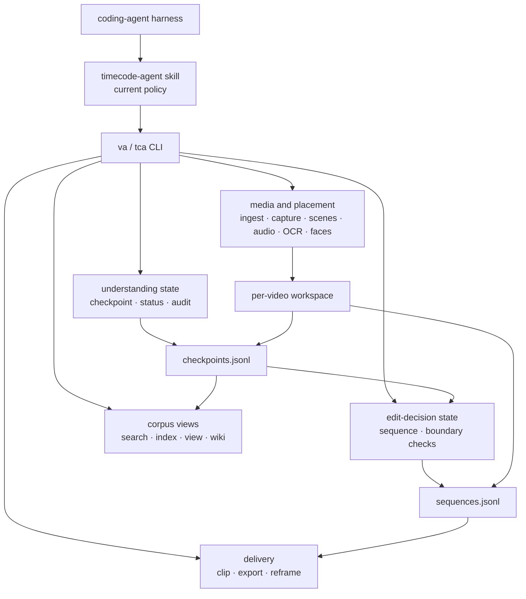

# Architecture

Last verified: 2026-07-25 against the current checkout.

TIMECODE-AGENT is one Python runtime with one current policy skill and two
physically separate append-only ledgers. The precise status is a
**shared-runtime dual-ledger foundation**:

- `checkpoints.jsonl` stores understanding claims and their revisions.
- `sequences.jsonl` stores edit decisions and their revisions.
- the current `timecode-agent` skill drives both loops through the same
  `va`/`tca` CLI.
- a separate `editcode-agent` policy and typed edit-to-understanding hand-back
  protocol are not implemented.

The package does not embed an LLM. A compatible coding-agent harness supplies
meaning-level judgment and invokes deterministic or learned local tools.

## Runtime map



## Measurement, perception and meaning

The placement/selection boundary is epistemic, not a claim that every
non-LLM tool is deterministic.

| Level | Examples | What it may establish |
|---|---|---|
| P0: physical or formal measurement | timestamps, frame differences, audio energy, sharpness | a measurable change or candidate location |
| P1: learned perception | ASR, OCR strings, faces, speaker turns, audio-event labels | a model-scored perceptual candidate |
| P2: semantic claim | identity, motive, event, causal relation, editorial role | an agent-authored interpretation that needs evidence |

P0 and P1 propose where inspection may be useful. They do not independently
promote a hypothesis to semantic truth. P2 claims are recorded as
checkpoints, with support and status tracked separately.

## Component boundaries

| Surface | Main implementation | Responsibility |
|---|---|---|
| Policy | `skill/SKILL.md` | transcript-first hypotheses, evidence selection, stopping and handoff rules |
| CLI | `src/video_agent/cli.py`, `cli_parser.py` | `va`/`tca` command contract and dispatch |
| Workspace commands | `cli_commands_workspace.py`, `cli_commands_global.py` | adapters between CLI requests and feature modules |
| Media and placement | `ingest.py`, `capture.py`, `keyframes.py`, `scenes.py`, `highlights.py`, `audio_events.py`, `ocr.py`, `faces.py`, `diarize.py` | media acquisition and P0/P1 candidates |
| Transcript projection boundary | `transcript_segments.py` | keeps valid finite ordered segments from a top-level array while brief/search/index/wiki/view/keyframe/diarization/SRT surfaces skip malformed members |
| Workspace and ledger locking | `workspace_lock.py`, `workspace.py`, `cli.py` | shared operation leases, one frozen leased corpus snapshot per command, inode-deduplicated aliases, stable sidecars and a read-only directory-inode fallback for legacy workspaces |
| Understanding ledger | `checkpoint_schema.py`, `checkpoint_store.py`, `checkpoints.py` | locked append-only claim history and latest-revision projection |
| Grounding and readiness | `verification.py`, `status.py`, `corpus_audit.py` | resolvable support checks, time overlap and advisory readiness |
| Image provenance | `image_model.py`, `image_store.py`, `image_catalog.py` | capture identity, cause and timestamp relations |
| Edit ledger | `sequence_schema.py`, `sequence_store.py`, `sequence_grounding.py` | ordered trims, forward-only states and checkpoint grounding |
| Delivery | `clip.py`, `export.py`, `reframe.py` | media extraction and EDL/FCPXML/OTIO/SRT/Markdown handoff |
| Corpus read model | `corpus_projection.py`, `search.py`, `index.py`, `scene_log.py`, `view.py`, `wiki.py` | cross-video search and derived human-readable views |

## Authority and persistence

| Artifact | Authority | Rule |
|---|---|---|
| manifest, transcript and signal JSON | base observations | generated by ingest and perception commands |
| `image-provenance.jsonl` | capture causality | locked append-only events; not semantic entailment |
| `checkpoints.jsonl` | understanding claims | append-only revisions in `hypothesized`, `verified` or `corrected` state |
| `sequences.jsonl` | edit decisions | append-only revisions in forward-only edit states |
| index, HTML view and exports | derived surfaces | rebuildable from authoritative inputs |
| wiki `tca:notes` and scene-log narrative | authored exception | preserved from existing files; not yet replayed from a ledger |

New workspaces create `.workspace.lock`, `.checkpoint.lock`,
`.image-provenance.lock`, and `.sequences.lock` before the manifest is
published. Each existing-workspace or corpus CLI command keeps a shared
operation lease for every canonical workspace it uses; ingest takes the
exclusive side before publishing or mutating a workspace and keeps it through
CLI manifest or signal-brief rendering. Corpus handlers use the exact leased
discovery snapshot, mutable aliases are replaced by their canonical targets,
and case or Unicode aliases are deduplicated by directory inode. Readers open stable
ledger targets read-only, so an atomic JSONL replacement cannot bypass a held
lock. Legacy workspaces without sidecars use the workspace directory inode and
empty reads remain non-mutating. Re-ingest preserves that legacy lock domain
instead of creating sidecars after publication. Because the operation and
ledger domains share that directory inode, each published legacy-workspace
command takes it exclusively for the command lifetime rather than attempting
a self-conflicting shared-to-exclusive upgrade. Logical lock names are resolved
through filesystem aliases before re-entrancy checks, so aliases to the same
inode cannot bypass an active lock.

Destructive whole-workspace GC pins the planned directory identity and latest
activity timestamp, then takes the exclusive operation lease and every ledger
lock without waiting before it removes anything. It atomically renames the
verified directory to a private same-parent claim before recursive removal, so
a fresh workspace at the public pathname survives. Replaced, changed, or
active workspaces are skipped. A partial recursive-delete failure is restored
when safe, reported as partial, and accounts only for bytes actually removed.
If the public name has already been reused, the report exposes the remaining
private claim path instead of overwriting the fresh workspace.

The authored exception matters: deleting a wiki or scene log that contains
those blocks loses authored state. The safe rebuild rule today is:

```text
ledgers + manifest + preserved authored blocks -> derived views
```

Scene-log title migration preserves conflicts explicitly. An authored canonical
log keeps priority. If the canonical log is absent or still a generated
placeholder, the newest authored stale `type: tca-scene-log` projection wins
by modification time and filename. Every other authored candidate moves intact
to the workspace path `conflicts/scene-logs/` (with a numeric suffix on name
collision), which future builds leave untouched. Only stale generated
placeholders are deleted.

Wiki entity rebuilds accept only regular local entity directories and pages.
Symlinked active/quarantine directories or pages fail closed before notes are
read, compared, moved or removed, preventing an external authored file from
being consumed by projection cleanup.

## Understanding and editing boundary

The two names below describe procedures, not separate installed agents.

| | Understanding loop | Editing loop |
|---|---|---|
| Question | what is present, when, and with what support? | does this ordered trim satisfy the brief and grounding gates? |
| Writes | checkpoint ledger | sequence ledger |
| Reads | transcript, signals, frames, prior checkpoints | checkpoints, signals and candidate media |
| Hard machine gates | schema, resolvable support and time overlap | schema plus terminal checkpoint grounding and revision pins |
| Human/agent judgment | meaning, identity, causality and sufficiency | selection, rhythm, montage and aesthetic intent |

An edit decision never mutates the understanding ledger. If a cut depends on
a wrong claim, the checkpoint is corrected upstream and the edit is
re-derived. This is a logical write boundary; caller-specific capability
enforcement is not implemented yet.

Self-reported model confidence is not a stopping proof. The policy stops only
when decision-critical claims have current support, relevant audit warnings
and contradictions are resolved or explicitly qualified, and another
inspection is unlikely to change the answer within the remaining budget.
`va status` readiness is advisory evidence for that decision.

## Implemented versus planned

| Implemented now | Not implemented |
|---|---|
| one product, repository, CLI, runtime and media cache | separate `editcode-agent` policy and thin orchestrator |
| separate checkpoint and sequence schemas, locks and files | caller-specific ledger write capabilities |
| terminal sequence grounding to supported, time-overlapping checkpoints | typed evidence request/resolution hand-back |
| terminal checkpoint revision/content-hash pins in edit handoff | edit-specific value-of-information policy |
| append-only image/capture provenance | W3C PROV serialization or C2PA signing |
| EDL, FCPXML, OTIO, SRT and Markdown delivery | universal NLE compatibility guarantee |
| on-demand FTS5 corpus search and Markdown/HTML/wiki views | persistent vector database or mandatory query router |
| deterministic cut-boundary measurements and advisory flags | viewer attention, working-memory or surprise estimator |

## Operating boundaries

- The tested runtime boundary is Python 3.12 on macOS and Linux. Windows is
  experimentally supported: ledger locks fall back to `msvcrt.locking` (shared requests degrade to exclusive; the legacy no-sidecar fallback creates the sidecar). CI verifies install, the lock round-trip, and the CLI on Windows; ffmpeg-based end-to-end flows are not yet exercised there.
- Media processing and persistence are local by default.
- The default installer prepares ungated faster-whisper, Apple-Silicon MLX and
  sherpa assets. Pyannote code is installed but its Hugging Face model remains
  account-gated; sherpa is the immediately usable fallback.
- All features start enabled. Persistent `va runtime` policy separates feature
  availability from backend selection: `balanced` keeps measured stable
  faster-whisper/software paths, while `low-power` selects MLX and
  VideoToolbox/AudioToolbox on Apple Silicon with ASR quality fallback.
- URL ingest uses the network; direct package installs may download models on
  first use.
- `VIDEO_AGENT_CACHE_DIR` overrides the cache root; Linux also honors
  `XDG_CACHE_HOME`.
- The coding-agent harness is external to this package and may use a hosted
  model or incur its own cost.
- OpenTimelineIO export produces OTIO timeline data and metadata; target NLE
  adapter support must be verified separately.
- The provenance ledger is evidence-traceable application state. It is not
  cryptographically tamper-evident and is not C2PA-equivalent.
